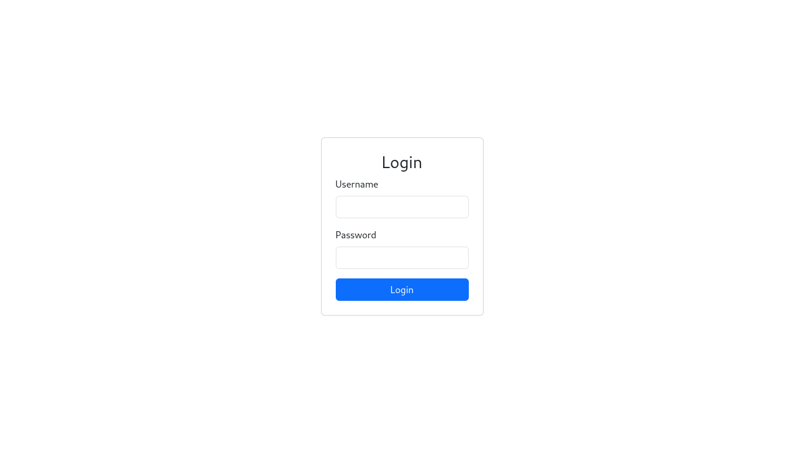
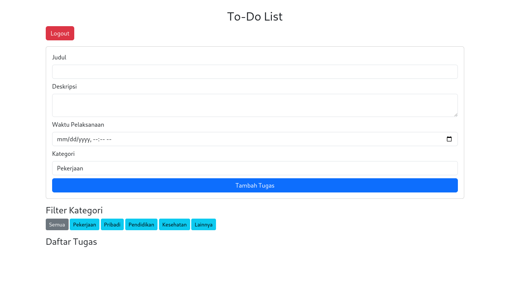
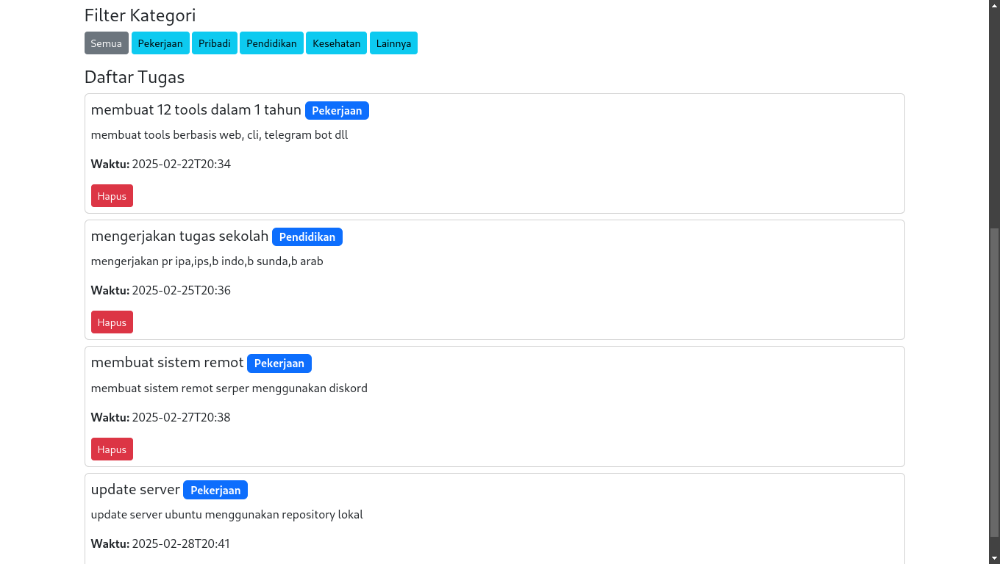
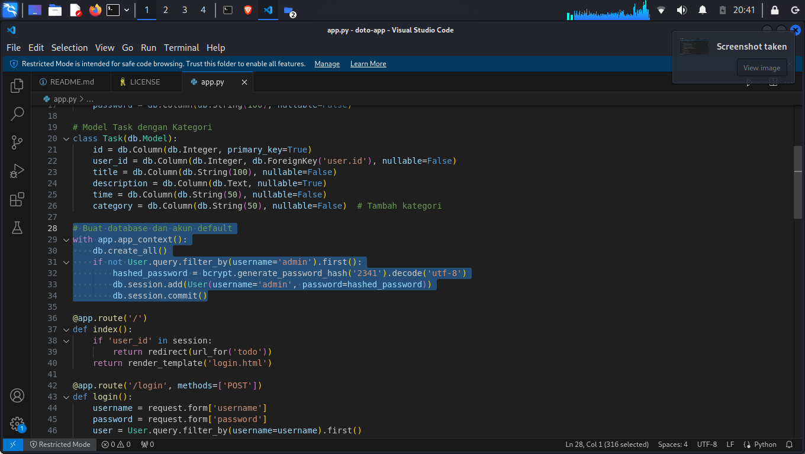

<h1 align="center">


</h1>

<h4 align="center"> do to list web interface. </h4>

<p align="center">

  <a href="http://python.org">
    

  <a href="https://sqlite.org/">
    
    
  <a href="https://getbootstrap.com/">
    

  <a href="https://en.wikipedia.org/wiki/Linux">
    
  </a>

</p>


### 🚀 Fitur:

- Login & Logout (Session-based) 
- Simpan tugas di database (lokal) 
- Tambah kategori tugas 
- Filter tugas berdasarkan kategori
- Bisa diakses dari perangkat lain dalam satu jaringan


### 🛠 Teknologi yang Digunakan:

- Flask (Python Web Framework) 
- SQLite (Database ringan)
- SQLite (Database ringan)

###  Platform yang Telah Diuji:
- OS: Kali GNU/Linux kali-rolling (kali-rolling) x86_64    
Host: X453SA 1.0
Kernel: 6.11.2-amd64  
Packages: 659 (pip), 2904 (dpkg)     
Shell: zsh 5.9  
CPU: Intel Celeron N3050 (2) @ 2.1GHz      
  


<br>


## 📦 Instalasi
1. **Clone repositori ini**  
   ```
   https://github.com/Aqid191161/do-to-list-web-interface.git
   ```

2. **masukke folder**  
   ```
   cd do-to-list-web-interface
   ```

3. **Buat & aktifkan virtual environment**  
   ```
   python -m venv doto-app
   source doto-app/bin/activate 
   ```

#### jika berhasil akan menampilkan
   ```
   ┌──(doto-app)─(root㉿kali)-[~]
   └─$ 
   ```

4. **Instalasi libraries**  
   ```
   pip3 install flask flask_sqlalchemy flask_bcrypt
   ```

5. **jalankan aplikasi**  
   ```
   python3 app.py
   ```


### Akses di browser:
- PC lokal: http://127.0.0.1:5000
- Perangkat lain: http://IP-ANDA:5000 (pastikan firewall mengizinkan)

### Default username and password:

- `username` : `admin`
- `password` : `2341`
<br>
 
>kode untuk username ada di app.py password
``
with app.app_context():
    db.create_all()
    if not User.query.filter_by(username='admin').first():
        hashed_password = bcrypt.generate_password_hash('2341').decode('utf-8')
        db.session.add(User(username='admin', password=hashed_password))
        db.session.commit()
``

### Screenshot

|  | |
|---|---|
| login |terminal |

|  | |
|---|---|
| daftar tugas | data user dan password |


# 🙌 Credit & Lisensi

## 🎉 Credit
Proyek ini dibuat menggunakan teknologi open-source. Terima kasih kepada:

- **[Flask](https://flask.palletsprojects.com/)** untuk backend  
- **[SQLite](https://www.sqlite.org/)** untuk database  
- **[Bootstrap 5](https://getbootstrap.com/)** untuk tampilan UI  

## 📄 Lisensi
Proyek ini dilisensikan di bawah **MIT License**. Anda bebas menggunakan, mengubah, dan mendistribusikan proyek ini dengan tetap menyertakan atribusi kepada pengembang asli.

Silakan baca file **[LICENSE](LICENSE)** untuk informasi lebih lanjut.


